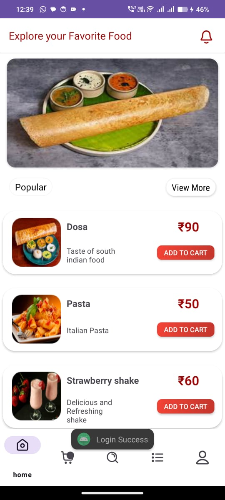
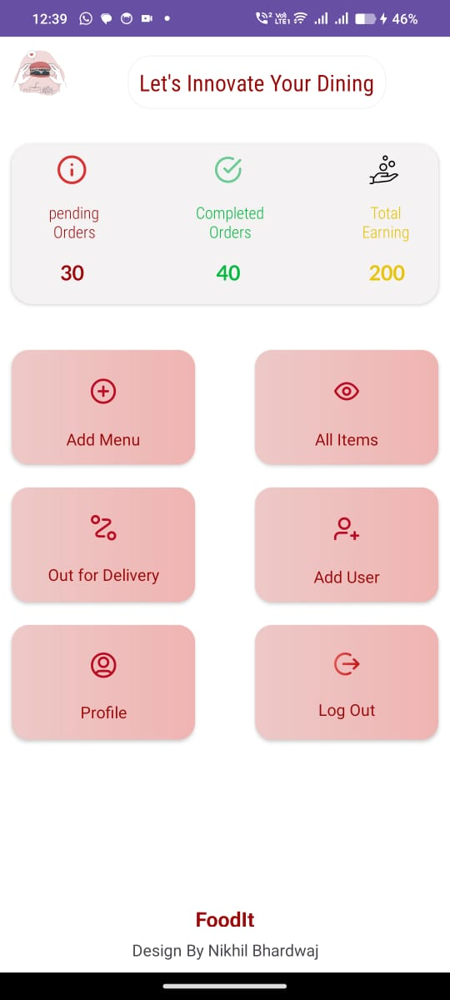
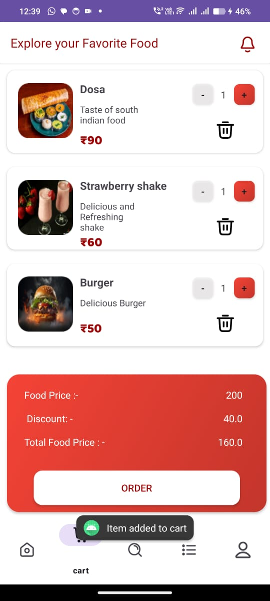
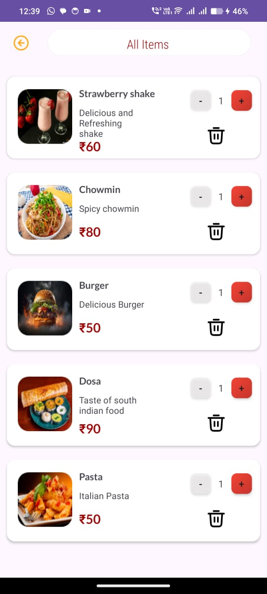

# 🍔 FoodIt - College Canteen Ordering App

FoodIt is a **food ordering system** designed for college canteens. It includes two applications:
- **FoodIt User**: Students can browse the menu, place orders, and make payments.
- **FoodIt Admin**: The canteen admin can manage orders, update the menu, and track sales.


## 📲 Screenshots & Demos

### 📷 Image Demos
| User App | Admin App |
|------------|------------|
|  |  |
|  |  |

### 🎥 Video Demo
[]

## 🚀 Features
### User App (FoodIt User)
✅ Browse food items 🥪🍕🍔  
✅ Add items to cart & place orders  
✅ Make secure payments via **Razorpay**  
✅ View past orders & order status  

### Admin App (FoodIt Admin)
✅ Add, edit, or remove food items  
✅ Manage incoming orders (approve, reject, mark as delivered)  
✅ View sales reports & order analytics 


---

## 🛠️ Technologies Used
### **Frontend (Android App)**
- **Kotlin** (MVVM Architecture)
- **XML (Jetpack Components)**
- **LiveData & ViewModel**
- **RecyclerView** for UI lists
- **Glide** (Image Loading)

### **Backend & Database**
- **Firebase Firestore** (Database)
- **Firebase Storage** (Food images, user profile pictures)
- **Firebase Authentication** (User login & admin access)
- **Cloud Functions** (Push notifications, order tracking)
- **Razorpay Payment Gateway** (Secure payments)

---


## 📥 Installation & Setup
### 1️⃣ Clone the Repository
```sh
git clone https://github.com/yourusername/FoodIt.git
cd FoodIt
```

### 2️⃣ Open in Android Studio & Setup Firebase
1. Open the project in **Android Studio**
2. Add your **google-services.json** file in `app/` directory
3. Sync Gradle files

### 3️⃣ Run the App
Click ▶️ **Run** in Android Studio or use the command:
```sh
./gradlew assembleDebug
```

---

## 🔐 Environment Variables (Secrets)
This project uses Firebase, so you'll need to create a `google-services.json` file and add it to your `app/` directory.

Also, for **Razorpay**, replace the `RAZORPAY_API_KEY` in `PaymentActivity.kt`:
```kotlin
val apiKey = "YOUR_SECRET_API_KEY"
```

---

## 📌 Project Structure
```
FoodIt/
│── User(footit_3)├──app/
│                 ├── src/
│                 │   ├── main/
│                 │   │   ├── java/com/example/foodit/
│                 │   │   │   ├── adapters/  # RecyclerView Adapters
│                 │   │   │   ├── models/     # Data Models
│                 │   │   │   ├── ui/         # Activities & Fragments
│                 │   │   │   ├── viewmodel/  # MVVM Architecture
│                 │   │   ├── res/
│                 │   │   │   ├── layout/     # XML UI Layouts
│                 │   │   │   ├── drawable/   # Icons & Images
│── admin(foodit_4)/ # Separate Admin Panel App
│── README.md
│── .gitignore
│── build.gradle
```

---

## ⚡ API Reference
This app uses Firebase Firestore as a backend, here are the Firestore **collection structures**:

### **Users Collection (`users/{userId}`)**
```json
{
  "userId": "abcd1234",
  "name": "John Doe",
  "email": "johndoe@email.com",
  "phone": "9876543210",
  "cart": [
    { "itemId": "pizza01", "quantity": 2 }
  ]
}
```

### **Orders Collection (`orders/{orderId}`)**
```json
{
  "orderId": "xyz9876",
  "userId": "abcd1234",
  "items": [
    { "itemId": "pizza01", "quantity": 2, "price": 150 }
  ],
  "status": "Pending",
  "timestamp": "2024-03-13T14:30:00Z"
}
```

---
---

## 👥 Contributing
1. **Fork** the repository 🍴
2. **Clone** your forked repo
   ```sh
   git clone https://github.com/yourusername/FoodIt.git
   ```
3. Create a new **feature branch**
   ```sh
   git checkout -b feature-branch-name
   ```
4. Make your changes & **commit**
   ```sh
   git commit -m "Added new feature"
   ```
5. **Push** your changes
   ```sh
   git push origin feature-branch-name
   ```
6. Open a **Pull Request** (PR) on GitHub 🚀

---

## 📜 License
This project is licensed under the **MIT License**. You can freely modify and distribute it.

---

## 📞 Contact
If you have any questions or need help, feel free to contact:
- **Email**: nikhillbhardwajjj@gmail.com 
- **GitHub**: [yourusername](https://github.com/Nikhill-Bhardwajjj)

---

### ⭐ If you like this project, consider giving it a **star** on GitHub! ⭐
